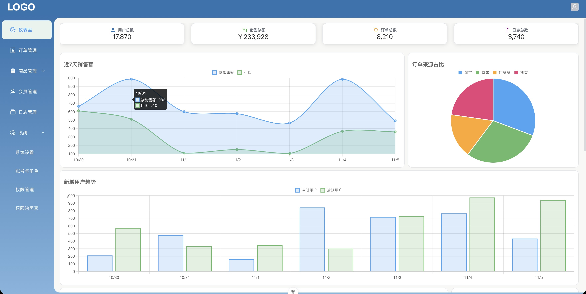
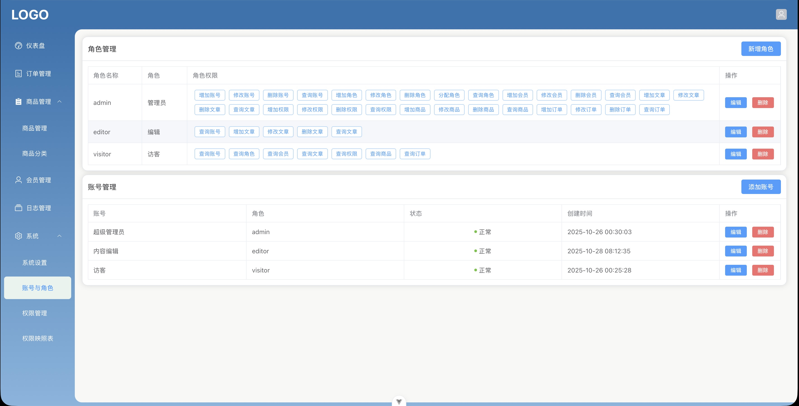

# vue-elplus-admin

vue3.x + element plus 管理后台 练习项目

### 目录：

```text
fake/
src/
├── api/
├── assets/
├── components/
│   ├── Chart.vue
│   ├── DetailForm.vue
│   ├── QueryDataTable.vue
│   ├── QueryForm.vue
│   ├── StatusDot.vue
│   └── types.ts
├── layouts/
├── plugins/
├── router/
├── stores/
├── styles/
├── types/
├── utils/
├── views/
│   ├── dashboard/
│   ├── login/
│   ├── logs/
│   ├── member/
│   ├── order/
│   ├── product/
│   ├── system/
├── App.vue
├── main.ts
└── README.md
```

### 路由:

- 仪表盘
- 订单管理
- 商品管理
  - 商品列表
  - 分类类别
  - 商品详情
- 会员管理
- 日志管理
- 系统
  - 系统设置
  - 账号与角色
  - 权限管理
  - 权限映照表

### 页面




### 封装组件

- Chart.vue
- DetailForm.vue
- QueryForm.vue
- QueryDetailTable.vue
- StatusDot.vue

#### DetailForm
封装详情页的表单，跟 `QueryForm` 稍有不同
但用法一致，接收两个 props `:fields="fields" :detail="detail"`

fields 是个数组:
```typescript
interface Field<TData extends Record<string, any> = any, TValue = any, TResult = string> {
    type: FieldType | HTMLInputElement['type']
    label: string
    value?: any
    options?: FieldOption[]
    prop: keyof TData & string
    props?: Record<string, unknown>
    placeholder?: string
    fmt?: Formatter<TValue, TResult>
}
```
像这样：
```typescript
const fields = ref<Field[]>([
    {
        type: 'input',
        label: '商品名称',
        prop: 'name',
        props: { placeholder: '请输入商品名' },
    },
    {
        type: 'cascader',
        label: '商品类别',
        prop: 'categoryName',
        props: { placeholder: '选择商品类别' },
        options: [],
        value: detail.categoryName,
    }
])
```

detail 就是 el-form 的 data，用于双向绑定。
